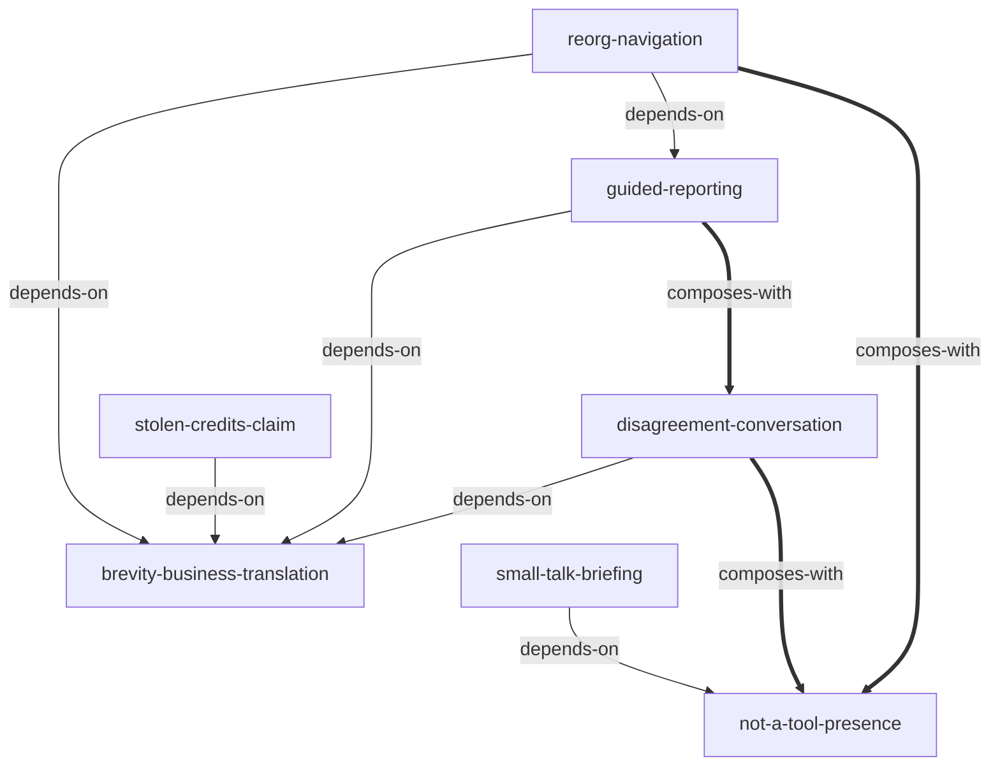

# 麦克老李职场通识与大厂生存学 — Skill Index

> 本书由 cangjie-skill 蒸馏，共产出 **7** 个 核心 skills。
> 处理时间: 2026-07-13

## 关于这本书

- **作者**: 麦克老李 (Mike Laoli)
- **年份**: 2026 年
- **一句话主旨**: 通过破除“中式礼貌与做题思维”，利用商业四维语言与主动提问机制，在动荡重组（Reorg）中获得资源、信任与晋升。
- **整书理解**: 见 [BOOK_OVERVIEW.md](./BOOK_OVERVIEW.md)
- **精华长文** (不读全书看这篇): [DIGEST.md](./DIGEST.md) (待生成)
- **术语词典**: [GLOSSARY.md](./GLOSSARY.md)

---

## Skill 列表 (按主题分组)

### 1. 商业指标精炼与逆向汇报

- [`brevity-business-translation`](./skills/brevity-business-translation/SKILL.md) — 用时间、金钱、客户满意度与战略机会精炼翻译高管沟通内容。
- [`guided-reporting`](./skills/guided-reporting/SKILL.md) — 引导式汇报，使用闭合提问获取默认同意，杜绝微观管理干涉。
- [`stolen-credits-claim`](./skills/stolen-credits-claim/SKILL.md) — 主动型争夺和维系工作成果功劳，高情商夺回台面能见度。

### 2. 气场防御与向上管理分歧

- [`not-a-tool-presence`](./skills/not-a-tool-presence/SKILL.md) — 社交气场防守，快速收回笑脸，跳出工具人与讨好者陷阱。
- [`disagreement-conversation`](./skills/disagreement-conversation/SKILL.md) — 理性向上表达异议，先对齐核心目标，再陈述客观业务风险并附带替代路径。

### 3. 重构机遇与职场社交破冰

- [`reorg-navigation`](./skills/reorg-navigation/SKILL.md) — 90天重组生存与卡位，发现新组织架构的缝隙空白并越级承担职责。
- [`small-talk-briefing`](./skills/small-talk-briefing/SKILL.md) — 利用极简名单与 AI 检索，在美式体育赛事和流行文化闲聊中轻松破冰。

---

## 引用图



图例:
- `-->`  depends-on
- `-.->` contrasts-with
- `===>` composes-with

---

## 推荐学习顺序

(从依赖图的叶子节点开始，向上)

1. **brevity-business-translation** — 最基础。改变学生思维，用最精炼的商业指标阐述工作。
2. **not-a-tool-presence** — 基础体态气场。学会不卑不亢的表情重置技术，杜绝谄媚赔笑。
3. **guided-reporting** — 依赖 brevity-business-translation。掌握快速放行的汇报武器。
4. **disagreement-conversation** — 与 guided-reporting 互补，配合 not-a-tool-presence。学会安全地向老板唱反调。
5. **stolen-credits-claim** — 依赖 brevity-business-translation。懂得利用技术深度和细节高情商夺回本属于你的功劳。
6. **small-talk-briefing** — 配合 not-a-tool-presence。3分钟速成闲聊，化解超级碗等赛事尬聊尴尬。
7. **reorg-navigation** — 终极卡位战。综合利用 guided-reporting、brevity-business-translation 与 not-a-tool-presence，在重组中逆势晋升。

---

## 安装使用

本目录是构建产物，宿主不会从这里加载 skill。要让 agent 真正调用，把 skill 目录复制到宿主的 skills 目录:

```bash
# 用户级 (所有项目可用)
cp -r skills/brevity-business-translation ~/.claude/skills/

# 或项目级
cp -r skills/brevity-business-translation <project>/.claude/skills/    # Claude Code
cp -r skills/brevity-business-translation <project>/.cursor/skills/    # Cursor
```

---

## 审计轨迹

- 候选单元池: [candidates/](./candidates/)
- BOOK_OVERVIEW: [BOOK_OVERVIEW.md](./BOOK_OVERVIEW.md)
